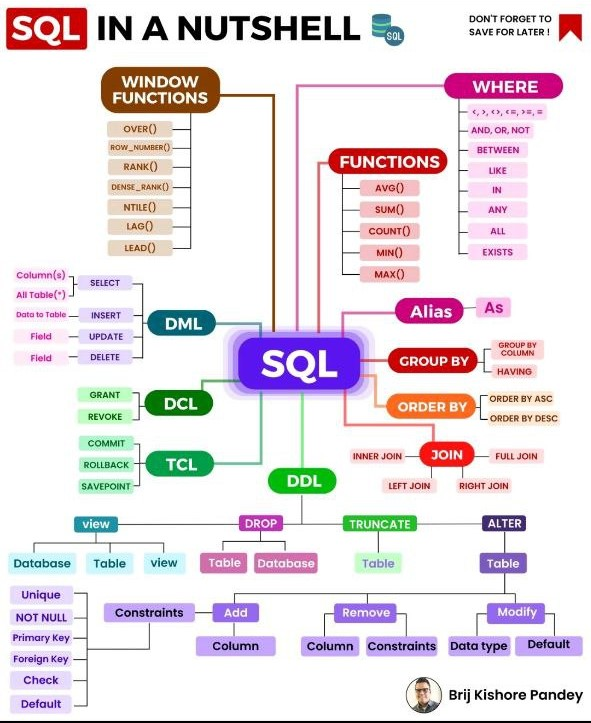

## 1. What is DBMS and what is its utility?

1. DBMS stands for **Database Management System**, is a set of applications or programs that enable users to create and maintain a database.

2. DBMS provides a tool or an interface for performing various operations such as inserting, deleting, updating, reading etc. into a database. 

3. It is software that enables the storage of data more compactly and securely as compared to a file-based system.

4. A DBMS system helps a user to overcome problems like data inconsistency, data redundancy, etc. in a database and makes it more convenient and organized to use it.

5. Examples of popular DBMS systems are file systems, XML, Windows Registry, etc.


## 2. What is RDBMS

1. RDBMS stands for Relational Database Management System and was introduced in the 1970s to access and store data more efficiently than DBMS.

2. RDBMS stores data in the form of tables as compared to DBMS which stores data as files.

3. Examples of popular RDBMS systems are MySQL, Oracle DB, etc.


## 3. Differences between DBMS and RDBMS


| DBMS          |RDBMS                                    | 
|---------------|-----------------------------------------|
| DBMS stores data as file.     | RDBMS stores data in tabular form.   |
| Data elements need to access individually.    | Multiple data elements can be accessed at the same time.   | 
| No relationship between data.    | Data is stored in the form of tables which are related to each other.   |
| DBMS does not support distributed database. | RDBMS supports distributed database.|
| xamples: XML, Window Registry, Forxpro, dbaseIIIplus etc. | Examples: MySQL, PostgreSQL, SQL Server, Oracle, Microsoft Access etc. |


## 4. What is a Database?

1. A Database is an organized, consistent, and logical collection of data that can easily be updated, accessed, and managed.

2. Database mostly contains sets of tables or objects (anything created using create command is a database object) which consist of records and fields.

3. A tuple or a row represents a single entry in a table. An attribute or a column represents the basic units of data storage, which contain information about a particular aspect of the table.

4. DBMS extracts data from a database in the form of queries given by the user.


## 5. Mention the issues with traditional file-based systems that make DBMS a better choice?

1. The absence of indexing in a traditional file-based system leaves us with the only option of scanning the full page and hence making the access of content tedious and super slow.

2. The other issue is redundancy and inconsistency as files have many duplicate and redundant data and changing one of them makes all of them inconsistent.

3. Accessing data is harder in traditional file-based systems because data is unorganized in them.

4. Another issue is the lack of concurrency control, which leads to one operation locking the entire page, as compared to DBMS where multiple operations can work on a single file simultaneously.

5. Integrity check, data isolation, atomicity, security, etc. are some other issues with traditional file-based systems for which DBMSs have provided some good solutions.

### Key Words

1. **Inconsistency** :
    - Data inconsistency is the scenario in DBMS where there are more than 2 tables within a database that work with the same data but receive it from different inputs.

    


2. **Redundancy** : 
    - Data redundancy in a Database Management System (DBMS) refers to the repetition of the same data in multiple places within a database.
    - It is a concern because it can lead to inconsistencies, update anomalies, and increased storage requirements, impacting data integrity and database performance.

3. **Integrity check** : 
    - Integrity constraints are rules that help to maintain the accuracy and consistency of data in a database. 
    - They can be used to enforce business rules or to ensure that data is entered correctly. 
    - For example, a simple integrity constraint in DBMS might state that all customers must have a valid email address.

4. **Data Isolation**:

    - data isolation refers to maintaining actions between transactions to prevent interference with each other’s operations.
    - The objective is to avoid situations where one transaction reads or modifies data while another transaction is simultaneously accessing it.
    - By doing data isolation ensures the accuracy, reliability


## 6. Explain a few advantages of a DBMS

1. **Data Sharing**: Data from a single database can be simultaneously shared by multiple users. Such sharing also enables end-users to react to changes quickly in the database environment.

2. **Integrity constraints**: The existence of such constraints allows storing of data in an organized and refined manner.

3. **Controlling redundancy in a database**: Eliminates redundancy in a database by providing a mechanism that integrates all the data in a single database.

4. **Data Independence**: This allows changing the data structure without altering the composition of any of the executing application programs.

5. **Provides backup and recovery facility**: It can be configured to automatically create the backup of the data and restore the data in the database whenever required.

6. **Data Security**:
    - DBMS provides the necessary tools to make the storage and transfer of data more reliable and secure. 
    - Authentication (the process of giving restricted access to a user) and encryption (encrypting sensitive data such as OTP, credit card information, etc.) are some popular tools used to secure data in a DBMS.


## 7. Explain different languages present in DBMS.



### Data Definition Language (DDL)

DDL commands are used to define the structure of the database. They include commands like CREATE, ALTER, DROP, and TRUNCATE.

**CREATE**: Used to create a new database object, such as a table.

```sql
CREATE TABLE Employees (
    EmployeeID INT PRIMARY KEY,
    FirstName VARCHAR(50),
    LastName VARCHAR(50),
    Email VARCHAR(100),
    HireDate DATE
);
```

**ALTER**: Used to modify an existing database object.

```sql
ALTER TABLE Employees ADD COLUMN Department VARCHAR(50);
```

**DROP**: Used to delete a database object.

```sql
DROP TABLE Employees;
```

**TRUNCATE**: Used to delete all rows from a table without deleting the table itself.

```sql
TRUNCATE TABLE Employees;
```

### Data Manipulation Language (DML)

DML commands are used to manipulate the data within the database. They include commands like SELECT, INSERT, UPDATE, and DELETE.

**SELECT**: Used to query and retrieve data from the database.

```sql
SELECT FirstName, LastName, Email FROM Employees WHERE Department = 'Sales';
```

**INSERT**: Used to add new rows to a table.

```sql
INSERT INTO Employees (EmployeeID, FirstName, LastName, Email, HireDate)
VALUES (1, 'John', 'Doe', 'john.doe@example.com', '2023-01-15');
```

**UPDATE**: Used to modify existing data within a table.

```sql
UPDATE Employees SET Department = 'Marketing' WHERE EmployeeID = 1;
```

**DELETE**: Used to remove rows from a table.

```sql
DELETE FROM Employees WHERE EmployeeID = 1;
```

### Data Control Language (DCL)

DCL commands are used to control access to data in the database. They include commands like GRANT and REVOKE.

**GRANT**: Used to give users access privileges.

```sql

GRANT SELECT, INSERT ON Employees TO User1;

```

**REVOKE**: Used to remove access privileges from users.

```sql

REVOKE INSERT ON Employees FROM User1;

```

### Transaction Control Language (TCL)

TCL commands are used to manage transactions within the database. They include commands like COMMIT, ROLLBACK, and SAVEPOINT.

**COMMIT**: Used to save the changes made during the current transaction.

```sql

BEGIN;
UPDATE Employees SET Department = 'IT' WHERE EmployeeID = 2;
COMMIT;

```

**ROLLBACK**: Used to undo changes made during the current transaction.

```sql
BEGIN;
UPDATE Employees SET Department = 'HR' WHERE EmployeeID = 3;
ROLLBACK;
```

**SAVEPOINT**: Used to set a savepoint within a transaction.

```sql

BEGIN;
UPDATE Employees SET Department = 'Finance' WHERE EmployeeID = 4;
SAVEPOINT SavePoint1;
UPDATE Employees SET Department = 'Admin' WHERE EmployeeID = 5;
ROLLBACK TO SavePoint1;
COMMIT;


```


## 8.  What is meant by ACID properties in DBMS?

ACID stands for Atomicity, Consistency, Isolation, and Durability in a DBMS these are those properties that ensure a safe and secure way of sharing data among multiple users.


**Atomicity**: This property reflects the concept of either executing the whole query or executing nothing at all, which implies that if an update occurs in a database then that update should either be reflected in the whole database or should not be reflected at all.


**Consistency**: This property ensures that the data remains consistent before and after a transaction in a database.


**Isolation**: This property ensures that each transaction is occurring independently of the others. This implies that the state of an ongoing transaction doesn’t affect the state of another ongoing transaction.


**Durability**: This property ensures that the data is not lost in cases of a system failure or restart and is present in the same state as it was before the system failure or restart.


## 9. Are NULL values in a database the same as that of blank space or zero?

No, a NULL value is very different from that of zero and blank space as it represents a value that is assigned, unknown, unavailable, or not applicable as compared to blank space which represents a character and zero represents a number.

Example: NULL value in “number_of_courses” taken by a student represents that its value is unknown whereas 0 in it means that the student hasn’t taken any courses.


