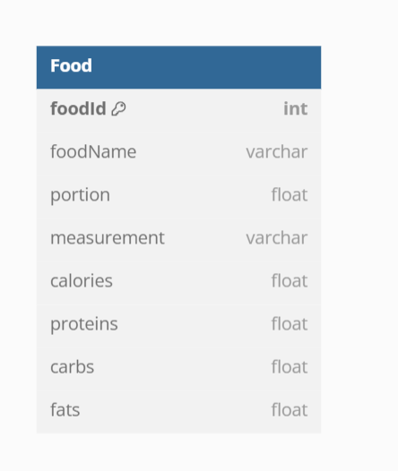
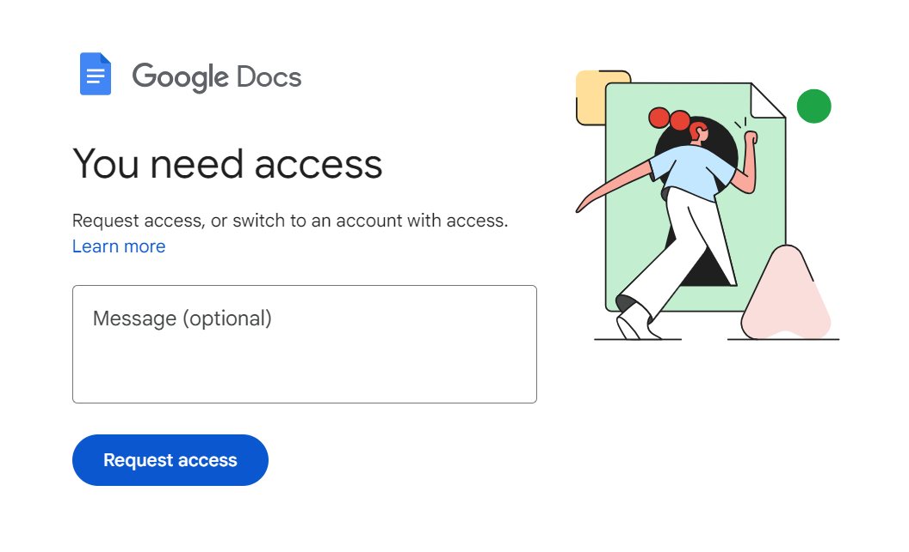

# Food Items

## Frontend

1. A user can create a food item with details such as the measurement unit, portion size, and the number of calories, proteins, fats, and carbs per unit. These food items will be used in diet plans. Users will have functionalities to search, edit, view, create, and delete an item.

![food Items View]

![Modal View]

## Backend



As you can see above, the food Items table can be defined as shown above. Let us see how we can write code for backend.

1. First Create a Model.Entity => which represents database tables and fields.
2. Next Create an Food Request in Model.dto => which facilitates data transfer without exposing the entity structure.
3. Next Create a JPA Repository for Food Items named FoodRepository => which contains interfaces that extend JpaRepository or CrudRepository for data access.
4. Next Create a Food Service => Contains service classes that contain business logic and interact with repositories.
5. Next create a controller file => which defines endpoints and handles user requests.

### SQL Queries for Food

#### 1. `createFood`

The `createFood` method saves a new food item to the database.

**SQL Query**:

```sql
INSERT INTO food (food_id, name, description, calories_per_unit, protein_per_unit, carbs_per_unit, fats_per_unit, quantity, unit)
VALUES (?, ?, ?, ?, ?, ?, ?, ?, ?);
```

**Explanation**:

- This query inserts a new row into the `food` table with the given values for `food_id`, `name`, `description`, `calories_per_unit`, `protein_per_unit`, `carbs_per_unit`, `fats_per_unit`, `quantity`, and `unit`.

#### 2. `getFoodById`

The `getFoodById` method retrieves a food item by its ID.

**SQL Query**:

```sql
SELECT * FROM food WHERE food_id = ?;
```

**Explanation**:

- This query selects all columns from the `food` table where the `food_id` matches the given ID.

#### 3. `getAllFoods`

The `getAllFoods` method retrieves all food items from the database.

**SQL Query**:

```sql
SELECT * FROM food;
```

**Explanation**:

- This query selects all columns from the `food` table, effectively retrieving all food items.

#### 4. `updateFood`

The `updateFood` method updates an existing food item with new values.

**SQL Query**:

```sql
UPDATE food
SET name = ?, description = ?, calories_per_unit = ?, protein_per_unit = ?, carbs_per_unit = ?, fats_per_unit = ?, quantity = ?, unit = ?
WHERE food_id = ?;
```

**Explanation**:

- This query updates the `name`, `description`, `calories_per_unit`, `protein_per_unit`, `carbs_per_unit`, `fats_per_unit`, `quantity`, and `unit` columns of the `food` table for the row where `food_id` matches the given ID.

#### 5. `deleteFood`

The `deleteFood` method deletes a food item by its ID.

**SQL Query**:

```sql
DELETE FROM food WHERE food_id = ?;
```

**Explanation**:

- This query deletes the row from the `food` table where `food_id` matches the given ID.

### Summary

1. **Create Food**: Inserts a new food item into the database.
2. **Get Food by ID**: Retrieves a specific food item by its ID.
3. **Get All Foods**: Retrieves all food items.
4. **Update Food**: Updates an existing food item.
5. **Delete Food**: Deletes a food item by its ID.

[](../assets/videoplayback.mp4)

https://github.com/cnu1328/InterviewPrep/assets/110097436/a96b9e9e-5817-441a-be32-c1d04e7a344e


